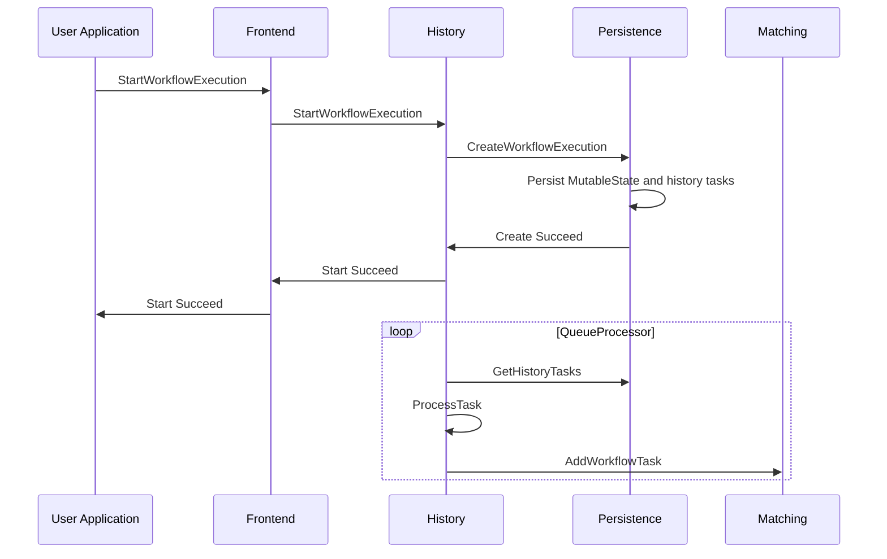
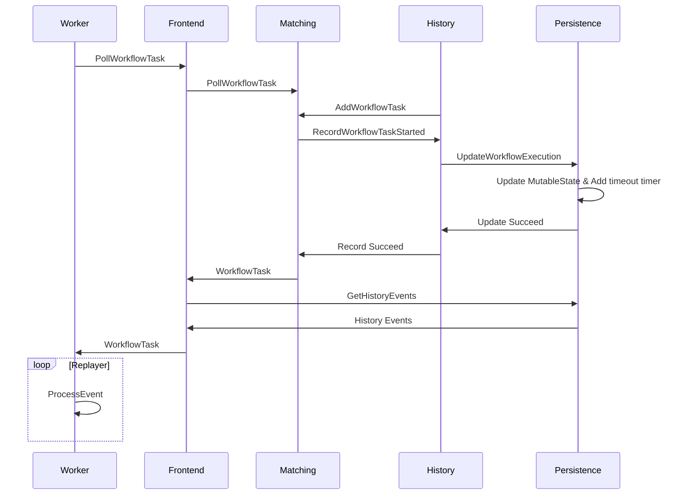
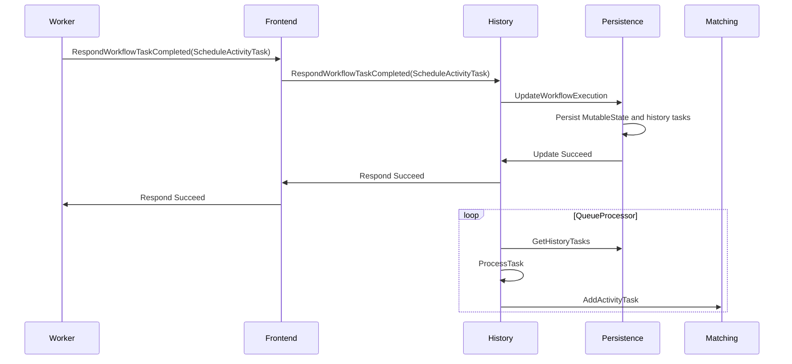
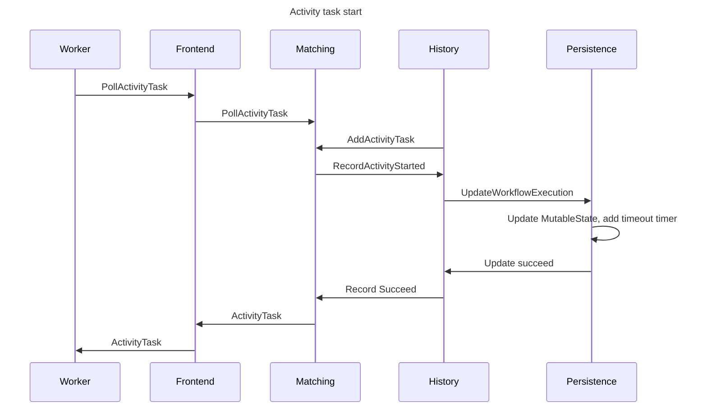
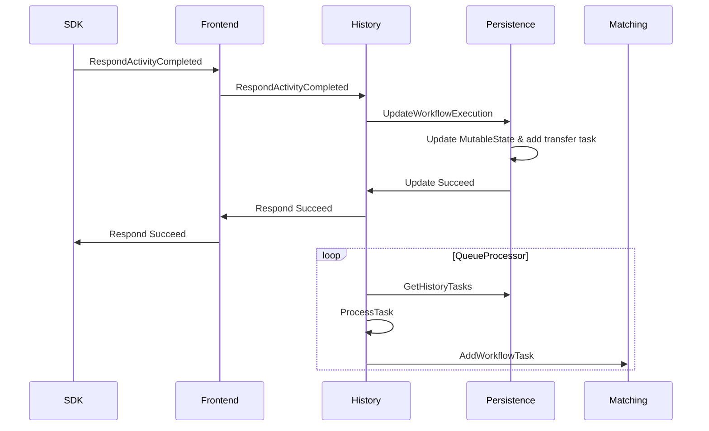
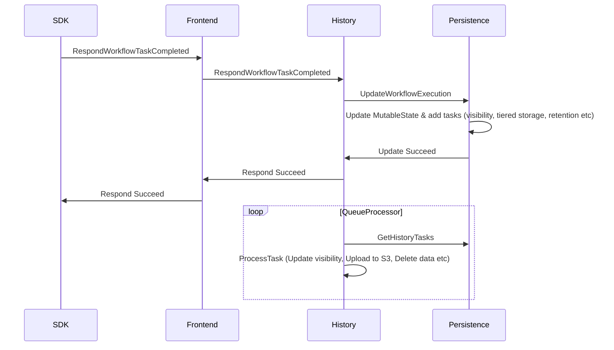

# High-level view

At the highest level, the components of a system using Temporal fall into two categories:

- **User-hosted processes**

  - The user's application communicates with the Temporal server using one of the [Temporal SDKs](https://docs.temporal.io/dev-guide).
  - The user runs Temporal [Worker](https://docs.temporal.io/workers) processes. These also use one of the Temporal SDKs and host the user's [Workflow](https://docs.temporal.io/workflows) and [Activity](https://docs.temporal.io/activities) code.

- **Temporal Server**<br>
  Users can host and operate the Temporal server and its database themselves, or use [Temporal Cloud](https://temporal.io/cloud).

<!-- https://lucid.app/lucidchart/0202e4b8-5258-4cd6-a6a0-67159300532b/edit -->


# Workflow lifecycle

Below we follow a typical sequence of events in the execution of the following very simple workflow:

```
myWorkflow() {
   result = callActivity(myActivity)
   return result
}
```

---

**1. The User Application uses a Temporal SDK to send a `StartWorkflowExecution` request to the Frontend service.**



- The Frontend Service uses a History Service client to call the [`StartWorkflow` handler](https://github.com/temporalio/temporal/blob/ef49189005b5323c532264287af6c08a447aab8a/service/history/api/startworkflow/api.go#L157).
- This initializes history events with a `WorkflowExecutionStarted` event, and persists new mutable state and a history task (transfer task).
- A [queue processor](https://github.com/temporalio/temporal/blob/ef49189005b5323c532264287af6c08a447aab8a/service/history/history_engine.go#L303) goroutine runs for every history task queue.
- The [transfer task queue processor](https://github.com/temporalio/temporal/blob/ef49189005b5323c532264287af6c08a447aab8a/service/history/queues/queue_immediate.go#L150) adds a Workflow Task in the appropriate task queue in the Matching Service.

---

**2. The Worker dequeues the Workflow Task, advances the workflow execution, and becomes blocked on the Activity call.**



---

**3. The Worker sends a `ScheduleActivityTask`; an Activity task is added in the Matching service.**



---

**4. The Worker dequeues the Activity task**



---

**4. The Worker sends `RespondActivityCompleted` to the History service; a Workflow Task is added to the Matching service**



---

**5. The Worker dequeues the Workflow Task, advances the workflow, and finds that it has reached its end**

\<Same sequence diagram as step 2 above\>

---

**6. The Worker sends `RespondWorkflowTaskCompleted` to the History Service**


